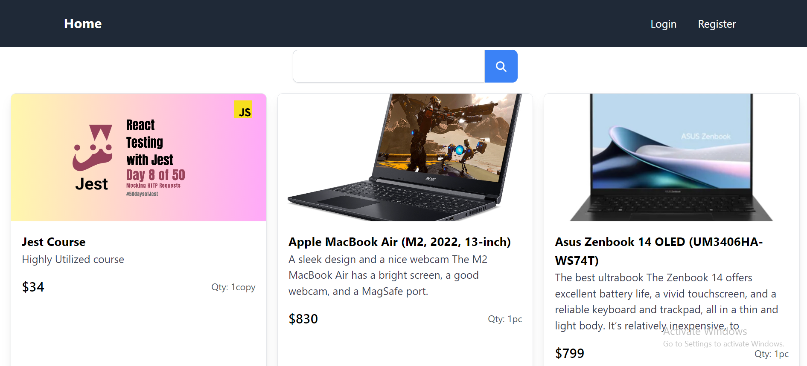
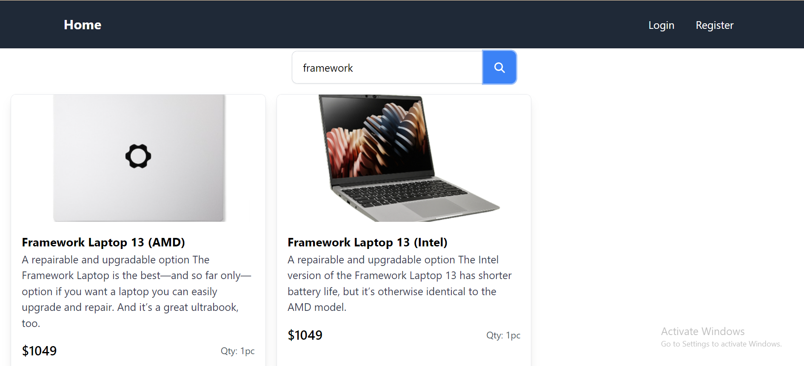
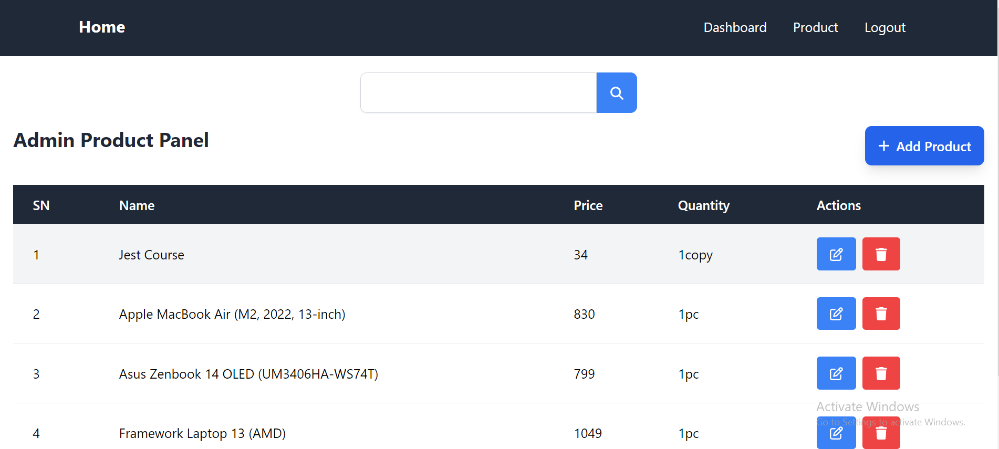
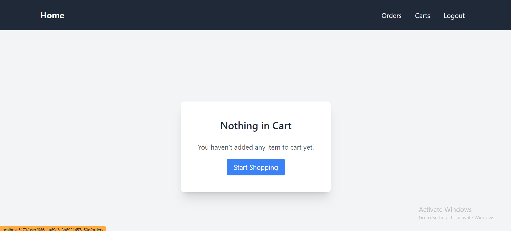
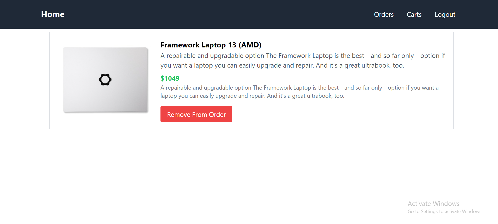
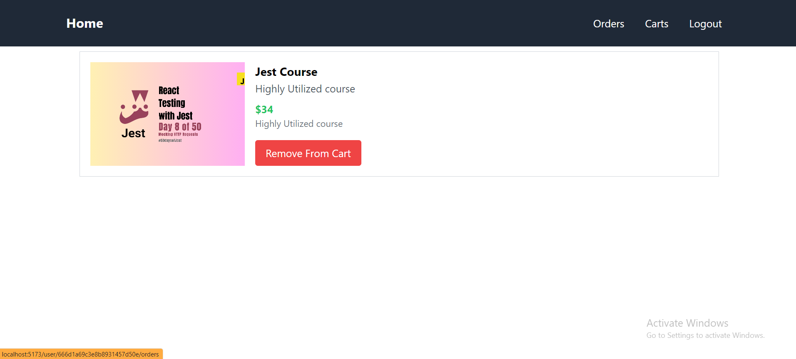
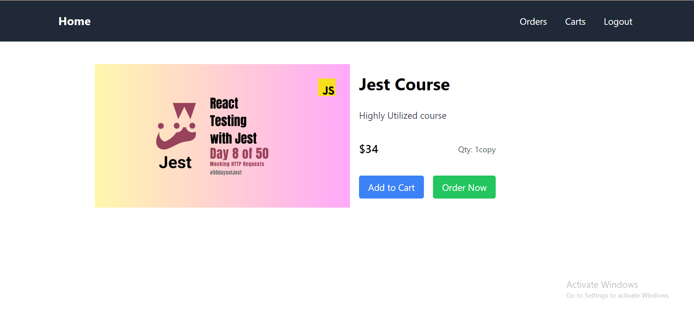

## E-Commerce Website
This is a simple e-commerce website that allows users to view products, add them to their cart, and checkout. The website is built using MongoDB as database, Express.js as backend, React.js as frontend, and Node.js as server. The website is not hosted anywhere but the database is hosted on MongoDB Atlas. The website is responsive and can be viewed on mobile devices as well. The website is secured using JWT authentication. The website is built as a project as a timepass and is not intended to be used in production. This website is built by me, [Manoj Shrestha](https://sthamanoj.com.np). 

## Features
1. Users can:
- View products
- Add products to cart
- Remove products from cart
- Checkout
- Login
- Register
- Logout
- Responsive

2. Admins can:
- Add products
- Edit products
- Delete products
- View static dashboard

# Technologies Used
1. MongoDB
2. Express.js
3. React.js
4. Node.js
5. JWT
6. Tailwind CSS
7. Bcrypt
8. Multer
9. Mongoose
10. MongoDB Atlas
11. Postman

# Environment Variables
Server side:
- PORT
- SERVER
- FRONTEND_URL
- MONGODB_URI
- JWT_SECRET

Client side:
- VITE_REACT_API

# How to run
1. Clone the repository
2. Run `npm install` in both client and server directories
3. Create a `.env` file in the server directory and add the environment variables
4. Run `npm run dev` in client directory to start the client
5. Run `nodemon server.js` in server directory to start the server
6. Open the browser and go to `http://localhost:5173`

# Video Demo
[Watch the video demo](https://www.youtube.com/watch?v=2yUDiGkooM8)

# Screenshots 

# License   
This project is licensed under the MIT License - see the [LICENSE](LICENSE) file for details.

# Acknowledgements
- [Manoj Shrestha](https://sthamanoj.com.np)
- [MongoDB](https://www.mongodb.com/)
- [Express.js](https://expressjs.com/)
- [React.js](https://reactjs.org/)
- [Node.js](https://nodejs.org/)

# Contact
- [Email](mailto:manojbicte@gmail.com)
- [Website](https://sthamanoj.com.np)
- [LinkedIn](https://www.linkedin.com/in/manoj-shrestha-newar/)
- [GitHub](https://github.com/manojtsx)
- [Twitter](https://twitter.com/manojtsx)
- [Instagram](https://www.instagram.com/remon.js/)
- [Facebook](https://www.facebook.com/manoj.jsx) 

# Thank you
Thank you for using my project. If you like this project, please give a star and share this project with your friends.

# ©️ Manoj Shrestha

